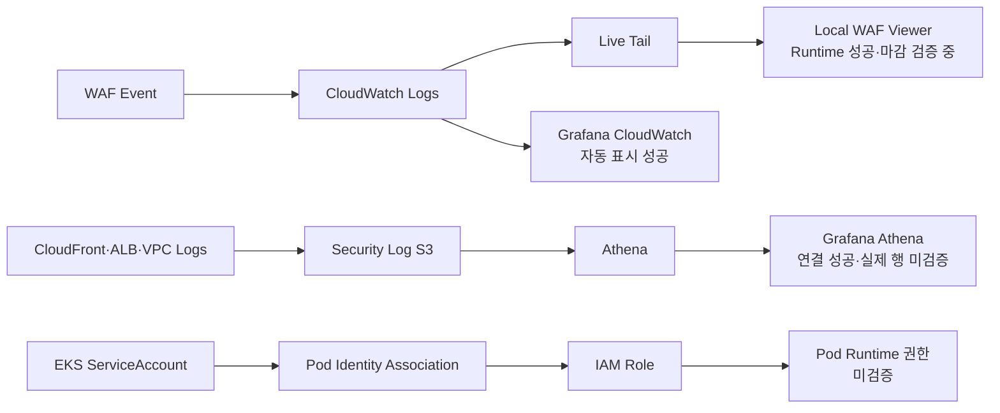

# Observability Current Status

> **용도:** 지금 어디까지 왔고, 바로 다음에 무엇을 해야 하는지만 확인하는 현황판  
> **기준 시점:** 2026-08-07  
> **현재 Focus:** WAF Live Tail Viewer 마감 검증  
> **관련 결정:** [`OBSERVABILITY-IAM-DECISIONS.md`](./OBSERVABILITY-IAM-DECISIONS.md)  
> **전체 계획:** [`OBSERVABILITY-IAM-IMPLEMENTATION-PLAN.md`](./OBSERVABILITY-IAM-IMPLEMENTATION-PLAN.md)

이 문서는 설계 근거와 장기 계획을 반복하지 않는다. 현재 상태는 다음 우선순위로 판정한다.

```text
실제 Runtime 출력·화면
→ 현재 Repository Source
→ 결정 문서
→ 구현 계획
```

계획에 적혀 있어도 Runtime에서 확인하지 않았으면 완료로 표시하지 않는다.

---

## 1. 한눈에 보는 현재 위치



### 현재 순서

```text
1. WAF Viewer 마감
2. S3 Prefix Runtime 검증
3. Athena 실제 행·조사 시각화
4. Pod Identity Runtime 검증
5. WAF 단계적 보강
```

순서를 바꾸지 않는다. 가장 가까운 길부터 닫는다.

---

## 2. 현재 Runtime

최근 제공된 `daily-up` 결과:

| 항목 | 확인값 |
|---|---|
| AWS Account | `433048100798` |
| Primary Region | `ap-northeast-2` |
| Application Image | `433048100798.dkr.ecr.ap-northeast-2.amazonaws.com/aws-topology/application:sha-bc0e2f404646da2333663725656ac67934807410` |
| Argo CD | `Synced / Healthy` |
| Argo CD Revision | `f04458ef32c67d6fc495d73c3773ef0b95204d34` |
| Application | `dvwa: Ready` |
| URL | `https://unoh.click` |
| Daily-up elapsed | `18.6 minutes` |

현재 Runtime은 WAF·Live Tail·S3·Athena·Pod Identity 검증을 수행할 수 있는 상태다.

> `daily-down.ps1` 실행 후에는 이 섹션을 그대로 신뢰하지 말고 Runtime 상태를 다시 확인한다.

---

## 3. Repository 상태

최근 로컬 확인 결과:

```text
Branch: main
Local main = origin/main
Ahead: 0
Behind: 0
Working Tree: clean
```

WAF Viewer Source:

```text
tools/waf-live-viewer/Start-WafLiveViewer.ps1
```

현재 파일은 Git 추적 대상이며 Remote `main`에도 존재한다.

관련 Viewer Commit:

```text
ab76388fb01cbc13aacc20c5b15418694d2e17bf
```

현재 Repository HEAD는 Viewer Commit 이후의 다른 운영 보정 Commit까지 포함할 수 있으므로, 작업 시작 전에는 항상 다음으로 동기화 상태만 확인한다.

```powershell
# Local과 origin/main의 앞섬·뒤처짐 및 Working Tree를 확인한다.
git status -sb

# Remote 참조만 갱신하고 Working Tree는 변경하지 않는다.
git fetch origin

# Fetch 이후 상태를 다시 확인한다.
git status -sb
```

---

## 4. Workstream 상태표

| Workstream | Source | Runtime | Evidence | 현재 판정 |
|---|---:|---:|---:|---|
| Local Docker Grafana | 있음 | 실행 성공 | Athena·CloudWatch 성공 화면 | **기반 완료** |
| Grafana CloudWatch WAF | 있음 | XSS·SQLi 자동 표시 | Obsidian Screenshot | **기능 성공 / Dashboard 마감 전** |
| CloudWatch Live Tail CLI | AWS 기능 | `print-only` 성공 | Raw Event 수신 | **Runtime 성공** |
| AWS CLI `interactive` Live Tail | 해당 없음 | Event Loop 오류 | 오류 확인 | **사용하지 않음** |
| Local WAF Live Viewer | Commit 완료 | XSS Card 표시 성공 | Viewer Screenshot | **기능 성공 / 검증 마감 전** |
| S3 → Athena Data Source | 있음 | `Save & test` 성공 | 성공 화면 | **연결 성공** |
| Athena Table 목록 | DDL 있음 | 3개 확인 | Query 결과 | **Metadata 확인** |
| Athena 실제 로그 행 | Query Pack 있음 | 미확인 | 없음 | **미검증** |
| S3 Source별 Prefix | Terraform 있음 | Object 미확인 | 없음 | **Source 구성 / Runtime 미검증** |
| EKS Pod Identity | Terraform 있음 | 전체 미확인 | 일부 과거 Evidence만 존재 | **Source 구성 / Runtime 미검증** |
| WAF 차단 보강 | 계획 있음 | 미적용 | 없음 | **계획만 존재** |

---

## 5. 지금까지 직접 확인한 사실

### 5.1 Grafana + CloudWatch

```text
통제된 XSS·SQLi Request
→ CloudFront WAF
→ CloudWatch Logs
→ Local Grafana
→ 5초 Auto Refresh로 자동 표시
```

확인값:

- CloudWatch Metrics API 연결 성공
- CloudWatch Logs API 연결 성공
- WAF Log Group: `us-east-1 / aws-waf-logs-aws-topology-edge`
- Raw JSON이 아닌 Field Table Query 실행 성공
- 체감 전체 표시 지연: 약 `10초`

정확한 최소·최대·평균 지연은 아직 측정하지 않았다.

### 5.2 CloudWatch Live Tail

성공한 경로:

```powershell
aws logs start-live-tail `
  --profile terra-user `
  --region us-east-1 `
  --log-group-identifiers "arn:aws:logs:us-east-1:433048100798:log-group:aws-waf-logs-aws-topology-edge" `
  --mode print-only
```

확인값:

- `terra-user`의 Live Tail 권한 정상
- Terraform·IAM 변경 불필요
- XSS WAF Event 스트리밍 수신
- 체감 지연: 약 `5초`
- 종료: `Ctrl+C`

`--mode interactive`는 Windows AWS CLI에서 다음 오류가 발생했으므로 현재 경로에서 제외한다.

```text
There is no current event loop in thread 'MainThread'.
```

### 5.3 Local WAF Live Viewer

현재 구조:

```text
AWS CLI start-live-tail --mode print-only
→ PowerShell JSON Parser
→ 127.0.0.1 Local HTTP Server
→ http://127.0.0.1:8787
```

확인된 기능:

- XSS Event Card 표시
- WAF 시각·수신 시각·지연 표시
- `COUNT → ALLOW` 구분
- Country·Method·Host·URI·Query 표시
- Client IP 마스킹
- Request ID·JA3·JA4·전체 Header·Cookie 미표시
- Raw Event 자동 저장 안 함
- localhost 전용 Bind

아직 완료로 판정하지 않는 항목:

- SQLi Card 분류
- 여러 Event 동시 표시
- Pause·Clear·Filter 동작
- `Ctrl+C` 후 Live Tail `aws` 자식 Process 정리
- 지연 5회 이상 측정
- README 존재 및 재현 절차

### 5.4 S3 + Athena

확인된 것:

- Athena Data Source: `Data source is working`
- Catalog: `AwsDataCatalog`
- Database: `aws_topology_security`
- Workgroup: `primary`
- Table 목록:

```text
cloudfront_access
alb_primary_access
vpc_reject
```

아직 확인하지 않은 것:

- 각 Table의 실제 로그 행
- Column Parsing과 NULL 상태
- 실제 S3 Object와 Table `LOCATION` 일치
- Query Scan량
- 조사용 Dashboard

### 5.5 현재 WAF 보호 수준

현재 WAF는 운영 차단 모드가 아니라 **훈련용 관찰 모드**다.

```text
Default Action: ALLOW
Common Rule Set: COUNT Override
SQLi Rule Set: COUNT Override
Logging Filter: COUNT·BLOCK만 KEEP
Authorization·Cookie: REDACTED
```

따라서:

```text
XSS 탐지
→ Managed Rule Match
→ COUNT
→ 최종 ALLOW
```

는 탐지 실패가 아니다. 잡고도 실습을 위해 통과시킨 상태다.

실제 BLOCK 전환은 현재 작업이 아니라 마지막 보강 단계다.

---

## 6. 원래 지시 4줄 충족도

| 지시 | 현재 상태 | 완료에 필요한 것 |
|---|---|---|
| S3 로그 분석·시각화 | Athena 연결·Table 목록 확인 | 실제 행 검증, 조사 Panel, Dashboard Export |
| EKS 각 Workload의 Pod Identity | 여러 Role·Association Source 존재 | 실제 Pod STS Role, 허용·거부 API, Node Role Negative Test |
| 리소스별 S3 로그 저장 구분 | Bucket + Source별 Prefix Source 존재 | 각 Prefix의 실제 Object와 Policy·LOCATION 일치 Evidence |
| 구성 결과를 설명하고 보기 | WAF Grafana·Live Tail·Viewer 일부 성공 | S3·Pod Identity까지 최종 Evidence와 시연 흐름 통합 |

전체 판정:

```text
완성 가능한 기반: 있음
근실시간 WAF 관제: 기능 성공
S3 분석: 연결 성공·내용 미검증
Pod Identity: Source 구성·Runtime 미검증
4줄 전체 완료: 아직 아님
```

---

## 7. 바로 다음 한 가지

### WAF Viewer 마감 검증

Viewer 실행:

```powershell
# Repository Root에서 PowerShell 7로 Viewer를 실행한다.
pwsh -File .\tools\waf-live-viewer\Start-WafLiveViewer.ps1
```

검증 순서:

1. XSS Event가 `XSS`로 표시되는지 재확인
2. SQLi Event가 `SQLi`로 표시되는지 확인
3. 일반 요청이 Logging Filter 때문에 나타나지 않는지 확인
4. Event 여러 건이 최신순으로 표시되는지 확인
5. `XSS`, `SQLi`, `BLOCK` Filter 확인
6. Pause·Resume·Clear 확인
7. 지연을 최소 5회 기록
8. `Ctrl+C`로 종료
9. Live Tail 자식 Process가 남지 않았는지 확인
10. README가 없으면 작성

종료 후 Process 확인:

```powershell
# start-live-tail 자식 Process가 남았는지만 확인한다.
Get-CimInstance Win32_Process |
  Where-Object {
    $_.Name -eq 'aws.exe' -and
    $_.CommandLine -match 'start-live-tail'
  } |
  Select-Object ProcessId, CommandLine
```

예상 결과:

```text
출력 없음
```

이 Gate가 끝날 때까지 S3, Pod Identity, WAF BLOCK 작업으로 넘어가지 않는다.

---

## 8. 그다음 순서

### Step 2 — S3 Prefix Runtime 검증

```text
CloudFront Prefix Object
ALB Prefix Object
VPC REJECT Prefix Object
Bucket Policy Write 범위
Athena LOCATION
```

### Step 3 — Athena 실제 로그 분석

```text
실제 행
Schema·NULL 상태
제한 시간 Query
DataScannedInBytes
조사용 Dashboard
```

### Step 4 — Pod Identity Runtime

```text
Workload
→ ServiceAccount
→ Association
→ IAM Role
→ sts:GetCallerIdentity
→ 허용 API
→ 비허용 API AccessDenied
```

### Step 5 — WAF 단계적 보강

```text
COUNT 기준선
→ 오탐 확인
→ 일부 Rule BLOCK 후보
→ terraform plan
→ 승인
→ protection-test
→ 정상 기능 Regression
→ 문제 시 COUNT Rollback
```

---

## 9. 지금 하지 않을 것

```text
WAF 전체 BLOCK 전환
새 Managed Rule Group 즉시 추가
Grafana Cloud 재시도
Amazon Managed Grafana
EventBridge·SNS Alert
자동 격리·자동 차단
Source별 S3 Bucket 재설계
Pod Identity 즉석 수정
추가 계획 문서 생성
Viewer UI 장식 확장
```

이 항목은 현재 Focus를 완료한 뒤 필요성을 다시 평가한다.

---

## 10. 종료했거나 보류한 길

| 경로 | 상태 | 이유 |
|---|---|---|
| Grafana Cloud Athena Plugin | 보류 | Data Source 생성 단계의 Plugin 오류 |
| Amazon Managed Grafana | 핵심 범위 제외 | 특정 Grafana 제품이 필수 아님 |
| AWS CLI Live Tail `interactive` | 사용 중단 | Windows Event Loop 오류 |
| S3/Athena를 실시간 관제 화면으로 사용 | 역할 변경 | 전달 지연이 있어 사후 분석 계층에 적합 |
| WAF 즉시 전면 BLOCK | 보류 | 훈련 환경과 정상 기능을 깨뜨릴 위험 |

---

## 11. Evidence 위치

### Repository

```text
OBSERVABILITY-IAM-DECISIONS.md
OBSERVABILITY-IAM-IMPLEMENTATION-PLAN.md
tools/waf-live-viewer/Start-WafLiveViewer.ps1
observability/queries/athena/
observability/Invoke-AthenaQueryPack.ps1
```

### Obsidian

```text
10_학습 노트/클라우드/Grafana 로컬 Docker에서 Athena 연결.md
10_학습 노트/클라우드/Grafana 로컬 Docker에서 CloudWatch WAF 근실시간 관제.md
```

공개 Repository와 Screenshot에는 Raw WAF Event의 다음 값을 그대로 남기지 않는다.

```text
전체 Client IP
Request ID
JA3·JA4 Fingerprint
Cookie
Authorization
전체 Header
AWS Credential
```

---

## 12. 이 문서 갱신 규칙

Checkpoint 하나가 끝났을 때만 이 파일을 갱신한다.

```text
현재 Focus
Runtime 표
Workstream 상태표
완료된 사실
바로 다음 한 가지
```

설계 결정이 바뀌면 `DECISIONS`를 수정하고, 전체 순서가 바뀌면 `IMPLEMENTATION-PLAN`을 수정한다. 단순 진행 상황은 이 파일만 수정한다.
