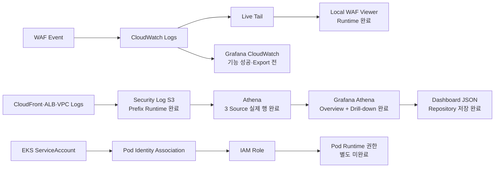

# Observability Current Status

> **용도:** 지금 어디까지 왔고, 바로 다음에 무엇을 해야 하는지만 확인하는 현황판  
> **기준 시점:** 2026-08-20
> **현재 Focus:** `GT-00·GT-01` PASS 뒤 `GT-02` 실제 Push Alert 검증 준비
> **관련 결정:** [`OBSERVABILITY-IAM-DECISIONS.md`](./OBSERVABILITY-IAM-DECISIONS.md)  
> **전체 계획:** [`OBSERVABILITY-IAM-IMPLEMENTATION-PLAN.md`](./OBSERVABILITY-IAM-IMPLEMENTATION-PLAN.md)  
> **보고서 Evidence:** [`report/OBSERVABILITY-EVIDENCE-INDEX.md`](./report/OBSERVABILITY-EVIDENCE-INDEX.md)

> [!IMPORTANT]
> 아래 장문은 2026-08-13 관측성 Snapshot을 보존한 기록이다. 현재 시연 순서와 완료
> 판정은 `시연_계획.md`만 따른다. Rule `100103`은 조기 경보이며
> 자동 격리 Trigger가 아니다. 다음 활성 작업은 `GT-00 → GT-01 → GT-02 → GT-03`이고,
> 고신뢰 S3 Rule이 `GT-03`을 통과하기 전에는 최종 Shuffle Write를 연결하지 않는다.

> [!STATUS]
> 2026-08-20 Runtime 기준 `GT-00` 공격 Rehearsal 3/3과 `GT-01` 동일 TAKE
> 5-Source Wazuh Timeline이 PASS했다. `GT-02`는 기존 Primary Queue backlog를 새
> TAKE와 분리하는 작업 전까지 시작하지 않는다. `GT-03`은 Rule `100104/100105` Source와
> 합성 `wazuh-logtest` Matrix까지만 통과했으며 실제 Event Runtime 판정은 아직 아니다.

현재 상태는 다음 우선순위로 판정한다.

```text
실제 Runtime 출력·화면
→ 현재 Repository Source
→ 결정 문서
→ 구현 계획
```

---

## 1. 한눈에 보는 현재 위치



### 현재 순서

```text
1. Gate 2 Coverage 판정 완료
2. 정상 GetObject Negative Control 완료
3. Gate 3 Alert Description Apply·Runtime·Post-Apply 0-change 완료
4. Wazuh 4.14.7 Local Docker Stack 기동 확인
5. Reader Role·Policy Apply·AssumeRole·Post-Apply 0-change 완료
6. 로컬 전용 Reader로 CloudTrail S3 Object 처리·Dashboard 집계 완료
```

S3 Source별 저장, Athena 실제 분석, Grafana Athena 시각화는 닫았다. 새 Athena Panel을 추가하거나 같은 Dashboard를 계속 다듬지 않는다.

---

## 2. 현재 Runtime

최근 제공된 `daily-up` 결과:

| 항목 | 확인값 |
|---|---|
| AWS Account | `433048100798` |
| Primary Region | `ap-northeast-2` |
| Application Image | `433048100798.dkr.ecr.ap-northeast-2.amazonaws.com/aws-topology/application:sha-bc0e2f404646da2333663725656ac67934807410` |
| Argo CD | `Synced / Healthy` |
| Application | `dvwa: Ready` |
| URL | `https://unoh.click` |

> `daily-down.ps1` 실행 후에는 이 Runtime 표를 그대로 신뢰하지 않고 다시 확인한다.

---

## 3. Workstream 상태표

| Workstream | Runtime Evidence | 현재 판정 |
|---|---|---|
| Local WAF Live Viewer | XSS·SQLi·Filter·Clear·Pause·종료·지연 검증 | **완료** |
| Grafana CloudWatch WAF | XSS·SQLi 자동 표시 성공 | **기능 성공 / Export 전** |
| Security Log S3 Prefix | CloudFront·ALB·VPC 최신 Object 확인 | **완료** |
| Bucket Policy Write Scope | Runtime Policy 확인 | **완료 / CloudFront 정밀화 후보** |
| Glue Table `LOCATION` | 세 Table 실제 Prefix와 일치 | **완료** |
| CloudFront Athena | 34행 / 343,161 B / 주요 Column 정상 | **완료** |
| ALB Athena | 29행 / 573,530 B / 주요 Column 정상 | **완료** |
| VPC REJECT Athena | 999행 이상 / 3,608,387 B / 주요 Column 정상 | **완료** |
| Grafana Athena Overview | VPC·CloudFront·ALB Panel 실제 값 표시 | **완료** |
| Grafana 시간 범위 연동 | Overview 3 Panel Dashboard 시간 선택기 반영 | **완료** |
| Grafana Drill-down | `/dvwa/css/` 정상 패턴, `/wp-admin/install.php` 반복 Probe 분석 | **완료** |
| Grafana Athena JSON Export | Repository에 Runtime Export 저장 | **완료** |
| Capital One 공격 Baseline | Command Injection→IMDS→Node Role→고정 가짜 S3 읽기 | **1회 성공** |
| Capital One 확정 탐지 | CloudTrail GetObject 1행·Metric Filter·새 Alarm 전환 | **완료** |
| Capital One 로그 Coverage | WAF·DVWA·IMDS 공백·CloudTrail·GuardDuty 0건 판정 | **Gate 2 완료** |
| Capital One 정상 대조군 | 정상 GetObject 1행·Alarm OK·상태 시각 불변 | **완료** |
| Wazuh Local Stack | Manager·Indexer·Dashboard 4.14.7, Docker·WSL 사전 조건 | **기동·CloudTrail 입력 확인** |
| Wazuh Reader Terraform | 2 Add·0 Change·0 Destroy Apply, AssumeRole 성공, Post-Apply 0-change | **완료** |
| Capital One Alert 필드 | 시간·Severity·Action·Actor·Object·Verdict Runtime 확인, Post-Apply 0-change | **완료** |
| Wazuh SIEM | CloudTrail 수집 확인, 기본 목록 밖 `GetObject` Alert 0건, Raw Archive 비활성 원인 확인 | **Gate 4 Archive·Custom Rule 전** |
| EKS Pod Identity | Source 정의 존재, Runtime 미검증 | **별도 미완료** |
| WAF Hardening | 계획만 존재 | **후속** |

`EKS Pod Identity`는 별도 미완료 Workstream이다. 현재 Focus 문구는 Capital One
대표 시나리오를 먼저 끝낸다는 실행 우선순위이며, Pod Identity 완료를 뜻하지 않는다.

---

## 4. 완료된 주요 Evidence

### 4.1 WAF Live Viewer

```text
Sample: 20, 17, 21, 20, 15, 20, 14초
최소: 14초
최대: 21초
평균: 약 18.1초
```

종료 후 `aws start-live-tail` 자식 Process와 TCP `8787` Listener가 남지 않는 것도 확인했다.

### 4.2 S3 Source별 Prefix

```text
CloudFront
→ AWSLogs/433048100798/CloudFront/

ALB
→ alb/primary/AWSLogs/433048100798/elasticloadbalancing/ap-northeast-2/

VPC REJECT
→ vpc-flow/AWSLogs/433048100798/vpcflowlogs/ap-northeast-2/
```

세 Source 모두 같은 Daily Runtime에서 최신 `.gz` Object를 생성했다.

### 4.3 Athena 실제 데이터

| Source | State | Data scanned | Rows |
|---|---:|---:|---:|
| CloudFront | SUCCEEDED | 343,161 B | 34 |
| ALB | SUCCEEDED | 573,530 B | 29 |
| VPC REJECT | SUCCEEDED | 3,608,387 B | 999+ |

VPC `999+`는 Query Pack의 결과 취득 상한 1000행에서 Header를 제외한 값이다.

### 4.4 Grafana Athena Dashboard

Dashboard:

```text
S3 Security Log Overview
```

Repository Export:

```text
analytics/dashboard/security-log-investigation.json
```

최종 Panel:

```text
VPC REJECT - Top Destination Ports
CloudFront - Top Requested Paths
ALB - Top Requested Routes
CloudFront - /dvwa/css/ Request Trace
CloudFront - /wp-admin/install.php Request Trace
```

검증 사항:

- CloudFront·ALB·VPC Overview가 각각 올바른 Athena Table을 조회한다.
- Overview 3 Panel은 Dashboard 시간 선택기를 실제 Query 범위에 반영한다.
- Drill-down SQL은 Client IPv4의 마지막 Octet을 `.xxx`로 마스킹한다.
- Credential, Raw Client IP, Request ID를 JSON에 하드코딩하지 않았다.
- Athena Data Source UID `efubxj2vag7i8b`는 보안정보가 아니지만 다른 Grafana에 Import할 때 재연결이 필요할 수 있다.

### 4.5 Drill-down 판정

#### `/dvwa/css/`

동일 Source의 `/`, `/login.php`, favicon, CSS 요청이 약 1초 내 연속 발생했다.

```text
정상 페이지 렌더링에 수반된 정적 리소스 요청 가능성 높음
```

#### `/wp-admin/install.php`

여러 Source에서 동일 WordPress 설치 경로가 반복 요청됐다.

```text
HTTP  GET /wp-admin/install.php → 301
HTTPS GET /wp-admin/install.php → 404
```

동일 Source 전후 ±60초에서 다른 관리·설정 Path 순회는 확인되지 않았다.

```text
반복 WordPress 설치 경로 Probe / 자동화 스캔 후보
다중 경로 정찰·공격 성공으로는 확대해석하지 않음
```

---

## 5. 원래 지시 4줄 충족도

| 지시 | 현재 상태 | 남은 것 |
|---|---|---|
| S3 로그 분석·Grafana 시각화 | 세 Source Athena + Grafana Overview + Drill-down + JSON Export | **완료** |
| EKS 각 Workload Pod Identity | Source 구성 존재 | Runtime STS·허용·거부·Node Role Negative Test |
| 리소스별 S3 로그 저장 구분 | 세 Prefix·최신 Object·Glue LOCATION 확인 | **핵심 완료** |
| 구성 결과 설명·시연 | WAF Viewer·S3·Athena·Grafana Drill-down 가능 | Pod Identity 후 최종 통합 |

전체 판정:

```text
근실시간 WAF 관제               완료
리소스별 S3 저장 구분            완료
Athena 실제 분석                 완료
Grafana S3/Athena 시각화         완료
Pod Identity Runtime             미검증
4줄 전체 완료                    아직 아님
```

---

## 6. 바로 다음 한 가지

### Gate 4 Raw Archive·Capital One Custom Rule

Baseline `capital-one-20260812T025054Z`는 다음 경로까지 실제 Runtime에서 닫혔다.

```text
DVWA Command Injection
→ Primary Karpenter Node IMDS Role 발견
→ 임시 Node Role Credential 획득(값 비노출)
→ validation/capital-one-demo.csv 가짜 5행 읽기·SHA-256 일치
→ CloudTrail GetObject 1행
→ Metric Filter
→ 새 CloudWatch Alarm 전환
```

같은 TAKE의 Coverage 판정:

| 구간 | 판정 | 핵심 근거 |
|---|---|---|
| CloudFront → WAF | 관측됨 | WAF 2건과 Runner의 두 Edge Request ID 정확히 일치 |
| WAF → DVWA | 부분 관측 | Apache `POST /vulnerabilities/exec/` 2건·HTTP 200, 공유 Request ID 없음 |
| DVWA 명령 실행 | 미수집 | 구조화 Audit에 Command Body·결과·IMDS 응답 없음 |
| Pod → IMDS | 결과 관측 / 네트워크 미수집 | Runner 성공, VPC Flow Logs는 AWS 제한상 IMDS 제외 |
| Node Role → S3 | 관측됨 | CloudTrail `GetObject` 1행·Role·Key·성공·시간창 일치 |
| GuardDuty | 탐지 없음 | TAKE 시작 약 49분 뒤 Finding 0건·전달 Event 0건, S3 Protection 비활성 |
| Custom Rule | 탐지됨 | Metric Filter와 새 Alarm 전환 |

정상 대조군 `capital-one-negative-20260812T034935Z`도 완료됐다.

```text
정상 terra-user → 고정 가짜 Object GetObject 1회
→ CloudTrail 성공 Event 정확히 1행
→ Primary Karpenter Node Role 아님
→ Alarm OK 유지·State Updated Timestamp 불변
→ Bundle SHA-256 50개 일치
```

Gate 3 Alert 필드 보강도 2026-08-12에 끝났다.

```text
기존 Saved Plan: 실행하지 않음
Fresh Plan: Alarm Description 1개 in-place update
Create / Delete / Replace: 0 / 0 / 0
Terraform Check: 10 / 10 pass
Apply 뒤 AWS describe-alarms: 여섯 Description 필드·SNS Action·OK 상태 확인
Terraform State와 AWS Runtime Description: 일치
Post-Apply Fresh Plan: 0 change
```

따라서 Gate 3을 위해 공격이나 정상 GetObject를 반복하지 않는다. 중앙 관제 제품은
Wazuh로 결정했고 별도 ELK Stack은 구축하지 않는다. Wazuh는 이미 만들어진 CloudWatch
Alarm을 입력받는 중계 화면이 아니라 다음 원본 Source를 직접 읽는다.

| Source | 현재 위치 | Wazuh 방식 | Source 변경 |
|---|---|---|---|
| CloudTrail | Foundation Security Log S3 | `bucket type="cloudtrail"` | 없음 |
| WAF | `us-east-1` CloudWatch Log Group | `service type="cloudwatchlogs"` | 없음 |
| Primary DVWA·Apache | `ap-northeast-2` CloudWatch Log Group | `service type="cloudwatchlogs"` | 없음 |

기존 `CloudTrail → Metric Filter → Alarm → SNS`는 AWS Native 탐지·사람 알림 경로로
그대로 유지한다. Wazuh Custom Alert만 Gate 5에서 Shuffle의 자동 대응 입력으로 사용해
같은 사건의 중복 Containment를 막는다.

2026-08-13 Host·Wazuh Runtime 판정:

```text
Logical Processor: 16
RAM: 31.3 GB
D Drive Free: 634.7 GB
Docker Client: 29.6.2
Docker Allocation: 16 CPU / 약 15.25 GiB
vm.max_map_count: 262144
Wazuh 4.14.7 Manager·Indexer·Dashboard: 모두 Up
CloudTrail 입력: Security Log S3 Object 처리·Dashboard 집계 완료
WAF·Primary DVWA 입력: 미연결
```

Reader Source는 `foundation/wazuh.tf`에 기본 비활성으로 구현했다. 정적 계약 Test와
`terraform validate`를 통과했고, 기본 비활성 Plan은 AWS Resource 0건, 활성 Plan은
Reader Role·Inline Policy 2 Add, 0 Change, 0 Destroy였다. 승인된 Saved Plan을 Apply했고
AWS 실제 Policy Action 네 개, 15분 AssumeRole 성공, Post-Apply Fresh Plan 0-change를
확인했다. Credential 값은 출력하거나 파일에 저장하지 않았다.

현재 수집 경계:

```text
only_logs_after = 2026-AUG-12
account = 승인 프로젝트 Account
region = ap-northeast-2
```

Wazuh 설치 전 실행한 Baseline도 해당 날짜의 CloudTrail Object가 S3에 보존돼 있다면 최초
Polling의 수집 대상이다. Dashboard에서 날짜를 넓혀 검색하는 작업은 Local Wazuh
Indexer 조회이므로 AWS Query 비용을 발생시키지 않는다. 수집 DB 초기화·무계획
`reparse`는 S3 재조회와 중복 Alert 가능성이 있어 현재 실행하지 않는다.

기존 Baseline 검색 결과:

```text
Last 7 days + S3 GetObject + validation/capital-one-demo.csv
→ 0건
→ Wazuh 기본 aws-eventnames에 GetObject 없음
→ logall_json=no, Filebeat archives.enabled=false
→ 기본 Rule 밖 원본이 Alert·Archive 어디에도 남지 않음
```

Gate 3 Bundle에는 실제 Query 결과 1행과 Sanitized CloudTrail Event가 남아 있다. 따라서
AWS 재조회나 새 공격 전에 이를 이용해 Custom Rule을 작성하고 `wazuh-logtest`로
오프라인 검증한다. 이후 Raw Archive를 활성화하고 새 통제 Event 1회로 실제 Alert를
검증한다. 과거 전체 `reparse`는 실행하지 않는다.

실제 최초 Runtime은 Terraform Reader Role의 임시 STS Session이 아니라 로컬 전용 IAM
User의 장기 Key를 Git 밖 Profile에 저장해 Read-only Mount했다. 또한 Wazuh의 Bucket
최상위 사전 확인 때문에 수동 Policy는 Bucket 전체 `ListBucket`을 허용하고 Object
내용은 CloudTrail Prefix `GetObject`로 제한했다. 현재 Terraform Reader Role의 Prefix
조건은 이 Runtime 요구와 맞지 않으므로 Source 보정·Fresh Plan·승인된 Apply 전에는
검증된 실행 경로로 주장하지 않는다.

---

## 7. 이후 순서

```text
Capital One Custom Rule 오프라인 작성·wazuh-logtest
→ Raw Archive 활성화·보존 확인
→ 새 통제 GetObject 1회·실제 Alert 확인
→ WAF·DVWA Raw Event 수집
→ 정상 대조군 오탐 없음 검증
→ SOAR Dry Run
→ GitOps Containment·재공격 실패
→ Terraform hardened 영구 복구
→ 기존 Pod Identity Workstream 재개
```

---

## 8. 지금 하지 않을 것

```text
Grafana Athena Panel 추가 확장
/wp-admin/install.php를 공격 성공으로 단정
새 Managed Rule Group 즉시 추가
WAF 전체 BLOCK 전환
Source별 S3 Bucket 재설계
Pod Identity 즉석 수정
```

---

## 9. Evidence 위치

### Repository

```text
OBSERVABILITY-IAM-DECISIONS.md
OBSERVABILITY-IAM-IMPLEMENTATION-PLAN.md
OBSERVABILITY-CURRENT-STATUS.md
report/OBSERVABILITY-EVIDENCE-INDEX.md
analytics/dashboard/security-log-investigation.json
tools/waf-live-viewer/
observability/queries/athena/
foundation/wazuh.tf
observability/wazuh/
tests/test-wazuh-foundation-contract.ps1
```

### Local Athena Evidence

```text
C:\Users\Unoh\Documents\aws-topology-evidence\athena-cloudfront-trace-20260807T021410Z
C:\Users\Unoh\Documents\aws-topology-evidence\athena-alb-window-20260807T022221Z
C:\Users\Unoh\Documents\aws-topology-evidence\athena-vpc-reject-20260807T022621Z
```

공개 Repository와 Screenshot에는 전체 Client IP, Request ID, JA3·JA4, Cookie, Authorization, 전체 Header, AWS Credential을 그대로 남기지 않는다.

---

## 10. 갱신 규칙

Checkpoint 하나가 끝났을 때만 갱신한다.

```text
현재 Focus
Workstream 상태표
완료된 Runtime 사실
바로 다음 한 가지
```
