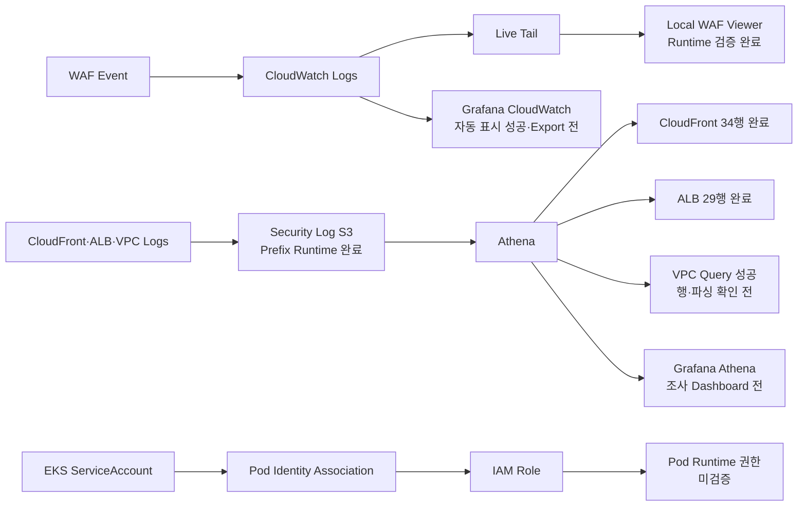

# Observability Current Status

> **용도:** 지금 어디까지 왔고, 바로 다음에 무엇을 해야 하는지만 확인하는 현황판  
> **기준 시점:** 2026-08-07  
> **현재 Focus:** `vpc_reject` Athena 결과 행·파싱 확인 → Grafana Athena 조사 Dashboard  
> **관련 결정:** [`OBSERVABILITY-IAM-DECISIONS.md`](./OBSERVABILITY-IAM-DECISIONS.md)  
> **전체 계획:** [`OBSERVABILITY-IAM-IMPLEMENTATION-PLAN.md`](./OBSERVABILITY-IAM-IMPLEMENTATION-PLAN.md)

이 문서는 설계 근거와 장기 계획을 반복하지 않는다. 현재 상태는 다음 우선순위로 판정한다.

```text
실제 Runtime 출력·화면
→ 현재 Repository Source
→ 결정 문서
→ 구현 계획
```

계획에 적혀 있어도 Runtime에서 확인하지 않았으면 완료로 표시하지 않는다.

---

## 1. 한눈에 보는 현재 위치



### 현재 순서

```text
1. VPC REJECT Athena 결과 행·파싱 확인
2. S3/Athena Grafana 조사 Dashboard 구성·Export
3. Grafana WAF Dashboard 마감·Export
4. Pod Identity Runtime 검증
5. WAF 단계적 보강
6. 최종 Evidence 통합
```

WAF Live Viewer와 S3 Prefix Runtime 검증은 닫았다. 새 Viewer 기능이나 S3 구조 변경으로 돌아가지 않는다.

---

## 2. 현재 Runtime

최근 제공된 `daily-up` 결과:

| 항목 | 확인값 |
|---|---|
| AWS Account | `433048100798` |
| Primary Region | `ap-northeast-2` |
| Application Image | `433048100798.dkr.ecr.ap-northeast-2.amazonaws.com/aws-topology/application:sha-bc0e2f404646da2333663725656ac67934807410` |
| Argo CD | `Synced / Healthy` |
| Argo CD Revision | `f04458ef32c67d6fc495d73c3773ef0b95204d34` |
| Application | `dvwa: Ready` |
| URL | `https://unoh.click` |
| Daily-up elapsed | `18.6 minutes` |

현재 Runtime은 Athena·Grafana·Pod Identity 검증을 수행할 수 있는 상태다.

> `daily-down.ps1` 실행 후에는 이 섹션을 그대로 신뢰하지 말고 Runtime 상태를 다시 확인한다.

---

## 3. Workstream 상태표

| Workstream | Source | Runtime | Evidence | 현재 판정 |
|---|---:|---:|---:|---|
| Local Docker Grafana | 있음 | Athena·CloudWatch 연결 성공 | 성공 화면 | **기반 완료** |
| Grafana CloudWatch WAF | 있음 | XSS·SQLi 자동 표시 | Obsidian Screenshot | **기능 성공 / Dashboard Export 전** |
| CloudWatch Live Tail CLI | AWS 기능 | `print-only` 성공 | Raw Event 수신 | **완료** |
| AWS CLI `interactive` Live Tail | 해당 없음 | Windows Event Loop 오류 | 오류 확인 | **사용하지 않음** |
| Local WAF Live Viewer | Script·README 있음 | 전체 Runtime Test 통과 | Viewer Screenshot·명령 출력 | **완료** |
| Security Log S3 Prefix | Terraform 있음 | 세 Source 최신 Object 확인 | S3 CLI 출력 | **완료** |
| Bucket Policy Write Scope | Terraform 있음 | Runtime Policy 확인 | S3 Policy 출력 | **확인 완료 / CloudFront 범위 보정 후보** |
| Glue Table `LOCATION` | DDL 있음 | 세 Table 모두 실제 Prefix와 일치 | Glue CLI 출력 | **완료** |
| CloudFront Athena | Query Pack 있음 | 34행·주요 Column 정상 | Local Evidence | **완료** |
| ALB Athena | Query Pack 있음 | 29행·주요 Column 정상 | Local Evidence | **완료** |
| VPC REJECT Athena | Query Pack 있음 | Query Pack 완료 | Local Evidence | **행·파싱 확인 전** |
| Grafana Athena Dashboard | 미완성 | 미검증 | 없음 | **현재 후속 작업** |
| EKS Pod Identity | Terraform 있음 | 전체 Runtime 미확인 | 일부 과거 Evidence | **Source 구성 / Runtime 미검증** |
| WAF 차단 보강 | 계획 있음 | 미적용 | 없음 | **계획만 존재** |

---

## 4. 완료된 Workstream

### 4.1 Local WAF Live Viewer

현재 구조:

```text
AWS CLI start-live-tail --mode print-only
→ PowerShell JSON Parser
→ 127.0.0.1 Local HTTP Server
→ http://127.0.0.1:8787
```

직접 확인:

- XSS·SQLi 분류
- 일반 ALLOW 요청 무표시
- 최신 Event 여러 건 표시
- XSS·SQLi·BLOCK Filter
- Filter별 Clear
- Pause·Resume와 Pause 중 Event 보존
- WAF Event 시각과 Local 수신 시각 기준 지연 계산
- `Ctrl+C` 종료 후 `aws start-live-tail` 자식 Process 미잔존
- 종료 후 TCP `8787` Listener 미잔존
- Client IP 마스킹
- Request ID·JA3·JA4·Cookie·전체 Header 미표시
- Raw Event 자동 저장 안 함
- README와 Source Commit·Push

지연 Sample:

```text
20, 17, 21, 20, 15, 20, 14초

최소: 14초
최대: 21초
평균: 약 18.1초
```

이 값은 WAF `timestamp`부터 Local Viewer 수신 시각까지의 측정치다. Pause 시간은 포함하지 않는다.

### 4.2 S3 Source별 Prefix Runtime

Security Log Bucket:

```text
aws-topology-security-logs-e10b7e4f152e9420159dba755d
```

| Source | 실제 Prefix | 최신 Object 확인 |
|---|---|---|
| CloudFront | `AWSLogs/433048100798/CloudFront/` | `2026-08-07T02:04:13Z`, 560 bytes |
| Primary ALB | `alb/primary/AWSLogs/433048100798/elasticloadbalancing/ap-northeast-2/` | `2026-08-07T02:00:11Z`, 396 bytes |
| Primary VPC REJECT | `vpc-flow/AWSLogs/433048100798/vpcflowlogs/ap-northeast-2/` | `2026-08-07T02:04:17Z`, 5,138 bytes |

세 Source 모두 같은 날 Daily Runtime에서 최신 `.gz` Log Object를 생성하고 있었다.

Glue `LOCATION`도 각각 위 Prefix와 일치했다.

Bucket Policy 확인:

```text
VendedLogWrite
- Principal: delivery.logs.amazonaws.com
- AWSLogs/433048100798/*
- vpc-flow/AWSLogs/433048100798/*

PrimaryAlbAccessLogWrite
- Principal: logdelivery.elasticloadbalancing.amazonaws.com
- alb/primary/AWSLogs/433048100798/*
```

판정:

```text
Source별 실제 저장 분리                완료
ALB 전용 Prefix Write 범위              확인
VPC Flow 전용 Prefix Write 범위         확인
CloudFront 실제 Prefix                  확인
CloudFront Policy Resource              실제 /CloudFront/ Prefix보다 넓음
```

CloudFront Policy 범위는 현재 기능 실패가 아니다. 최소 권한 정밀화 후보로 남기되, 지금 S3 구조를 즉시 재설계하지 않는다.

---

## 5. Athena 실제 데이터 검증

### 5.1 CloudFront — 완료

첫 실행은 기존 Glue Table에 `cs-protocol` Column이 없어 Query Pack의 사전검사에서 중단됐다.

승인된 `-CreateSchema` 재실행으로:

```text
CREATE TABLE IF NOT EXISTS 실행
→ 기존 S3 Object 유지
→ 누락된 cs-protocol Column만 ALTER TABLE ADD COLUMNS
→ CloudFront SELECT 실행
```

결과:

| 항목 | 결과 |
|---|---|
| Experiment ID | `athena-cloudfront-trace-20260807T021410Z` |
| Query State | `SUCCEEDED` |
| QueryExecutionId | `f86c0bbe-5c1b-478d-ae08-e64b44dece32` |
| Data scanned | `343,161 bytes` |
| Returned rows | `34` |
| 주요 Column | 정상 파싱 |

확인된 Column:

```text
date
time
source_ip
method
path
status
edge_request_id
protocol
time_taken
```

`protocol` 값의 `http`·`https`는 HTTP Version이 아니라 CloudFront `cs-protocol` Scheme이다.

Local Evidence:

```text
C:\Users\Unoh\Documents\aws-topology-evidence\athena-cloudfront-trace-20260807T021410Z
```

### 5.2 Primary ALB — 완료

결과:

| 항목 | 결과 |
|---|---|
| Experiment ID | `athena-alb-window-20260807T022221Z` |
| Query State | `SUCCEEDED` |
| Data scanned | `573,530 bytes` |
| Returned rows | `29` |
| RegexSerDe 주요 Column | 정상 파싱 |

확인된 Column:

```text
event_time
source_ip
method
route
elb_status_code
target_status_code
trace_id
```

`/wp-admin/install.php → 404` 같은 행이 보였지만, CloudFront 뒤 ALB의 `source_ip`를 곧바로 외부 공격자 IP로 단정하지 않는다. 현재는 Schema·Query 동작 증거로만 사용한다.

Local Evidence:

```text
C:\Users\Unoh\Documents\aws-topology-evidence\athena-alb-window-20260807T022221Z
```

### 5.3 Primary VPC REJECT — 실행 성공, 결과 확인 전

실행:

```text
Experiment ID: athena-vpc-reject-20260807T022621Z
Query Pack: completed
```

Query Pack Source상 `SUCCEEDED`가 아니면 완료 문구 전에 예외가 발생하므로 SELECT 실행은 성공한 것으로 판정한다.

아직 확인하지 않은 것:

- `DataScannedInBytes`
- 반환 Data Row 수
- `srcaddr`, `dstaddr`, `dstport`, `protocol`
- `rejected_flows`, `rejected_packets`
- IP 마스킹 후 Sample Row

Local Evidence:

```text
C:\Users\Unoh\Documents\aws-topology-evidence\athena-vpc-reject-20260807T022621Z
```

---

## 6. 원래 지시 4줄 충족도

| 지시 | 현재 상태 | 완료에 필요한 것 |
|---|---|---|
| S3 로그 분석·시각화 | CloudFront·ALB 실제 행 완료, VPC Query 성공 | VPC 행 확인, Grafana Athena Panel·Dashboard Export |
| EKS 각 Workload의 Pod Identity | 여러 Role·Association Source 존재 | 실제 Pod STS Role, 허용·거부 API, Node Role Negative Test |
| 리소스별 S3 로그 저장 구분 | 세 Prefix·최신 Object·Glue LOCATION 확인 | **핵심 완료**. CloudFront Policy 정밀화는 별도 후보 |
| 구성 결과를 설명하고 보기 | WAF Viewer 완료, S3·Athena Runtime 일부 완료 | Athena Grafana 시각화, Pod Identity Evidence, 최종 시연 흐름 |

전체 판정:

```text
근실시간 WAF 관제               완료
리소스별 S3 저장 구분            완료
Athena 실제 분석                 3개 중 2개 완료, VPC 결과 확인 전
Grafana S3/Athena 시각화         미완료
Pod Identity Runtime             미검증
4줄 전체 완료                    아직 아님
```

---

## 7. 바로 다음 한 가지

### VPC REJECT Athena 결과 행·파싱 확인

```powershell
$root = 'C:\Users\Unoh\Documents\aws-topology-evidence\athena-vpc-reject-20260807T022621Z'

$summary = Get-Content `
  "$root\results\athena\athena-run-summary.json" `
  -Raw | ConvertFrom-Json

$summary.Executions |
  Select-Object Label, State, DataScannedInBytes, EngineExecutionTimeInMillis, QueryExecutionId |
  Format-Table -AutoSize

$result = Get-Content `
  "$root\results\athena\vpc-reject-results.json" `
  -Raw | ConvertFrom-Json

"Returned data rows: $(@($result.ResultSet.Rows).Count - 1)"
```

그다음 Sample Row에서 Source·Destination IP를 마스킹한 뒤 다음 Column이 실제 값인지 확인한다.

```text
srcaddr
dstaddr
dstport
protocol
rejected_flows
rejected_packets
```

이 Gate를 통과하면 세 Athena Table의 실제 행 검증을 닫고 Grafana Athena Dashboard로 이동한다.

---

## 8. 이후 순서

### Step 2 — Grafana Athena 조사 Dashboard

```text
CloudFront 최근 요청·Status·Top Path
ALB Route·Status·Trace
VPC REJECT Top Source·Destination Port
Time Range 제한
Dashboard JSON Export
Screenshot
```

Athena는 실시간 관제 경로가 아니다. 자동 갱신 주기를 짧게 두지 않고 필요할 때 조사·시연한다.

### Step 3 — Grafana WAF Dashboard 마감

```text
최근 WAF 탐지 Event Table
최근 COUNT·BLOCK 수
XSS·SQLi 구분
Dashboard JSON Export
```

### Step 4 — Pod Identity Runtime

```text
Workload
→ ServiceAccount
→ Association
→ IAM Role
→ sts:GetCallerIdentity
→ 허용 API
→ 비허용 API AccessDenied
→ Node Role Negative Test
```

### Step 5 — WAF 단계적 보강

```text
COUNT 기준선
→ 오탐 확인
→ 일부 Rule BLOCK 후보
→ terraform plan
→ 승인
→ protection-test
→ 정상 기능 Regression
→ 문제 시 COUNT Rollback
```

### Step 6 — 최종 Evidence 통합

```text
WAF Viewer·Grafana
S3 Prefix·Policy·LOCATION
Athena Query Summary·Rows·Scan량
Pod Identity Matrix·허용·거부
최종 시연 순서
```

---

## 9. 지금 하지 않을 것

```text
WAF 전체 BLOCK 전환
새 Managed Rule Group 즉시 추가
Grafana Cloud 재시도
Amazon Managed Grafana
EventBridge·SNS Alert
자동 격리·자동 차단
Source별 S3 Bucket 재설계
Pod Identity 즉석 수정
Viewer 기능 추가
VPC 결과 확인 전 Dashboard 추정 작성
```

---

## 10. Evidence 위치

### Repository

```text
OBSERVABILITY-IAM-DECISIONS.md
OBSERVABILITY-IAM-IMPLEMENTATION-PLAN.md
OBSERVABILITY-CURRENT-STATUS.md
tools/waf-live-viewer/Start-WafLiveViewer.ps1
tools/waf-live-viewer/README.md
observability/queries/athena/
observability/Invoke-AthenaQueryPack.ps1
```

### Local Athena Evidence

```text
C:\Users\Unoh\Documents\aws-topology-evidence\athena-cloudfront-trace-20260807T021410Z
C:\Users\Unoh\Documents\aws-topology-evidence\athena-alb-window-20260807T022221Z
C:\Users\Unoh\Documents\aws-topology-evidence\athena-vpc-reject-20260807T022621Z
```

### Obsidian

```text
10_학습 노트/클라우드/Grafana 로컬 Docker에서 Athena 연결.md
10_학습 노트/클라우드/Grafana 로컬 Docker에서 CloudWatch WAF 근실시간 관제.md
```

공개 Repository와 Screenshot에는 다음 값을 그대로 남기지 않는다.

```text
전체 Client IP
Request ID
JA3·JA4 Fingerprint
Cookie
Authorization
전체 Header
AWS Credential
```

---

## 11. 갱신 규칙

Checkpoint 하나가 끝났을 때만 이 파일을 갱신한다.

```text
현재 Focus
Runtime 표
Workstream 상태표
완료된 사실
바로 다음 한 가지
```

설계 결정이 바뀌면 `DECISIONS`를 수정하고, 전체 순서가 바뀌면 `IMPLEMENTATION-PLAN`을 수정한다. 단순 진행 상황은 이 파일만 수정한다.
