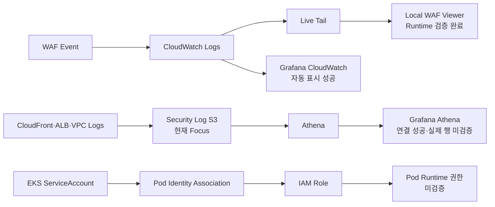

# Observability Current Status

> **용도:** 지금 어디까지 왔고, 바로 다음에 무엇을 해야 하는지만 확인하는 현황판  
> **기준 시점:** 2026-08-07  
> **현재 Focus:** S3 Source별 Prefix Runtime 검증  
> **관련 결정:** [`OBSERVABILITY-IAM-DECISIONS.md`](./OBSERVABILITY-IAM-DECISIONS.md)  
> **전체 계획:** [`OBSERVABILITY-IAM-IMPLEMENTATION-PLAN.md`](./OBSERVABILITY-IAM-IMPLEMENTATION-PLAN.md)

이 문서는 설계 근거와 장기 계획을 반복하지 않는다. 현재 상태는 다음 우선순위로 판정한다.

```text
실제 Runtime 출력·화면
→ 현재 Repository Source
→ 결정 문서
→ 구현 계획
```

계획에 적혀 있어도 Runtime에서 확인하지 않았으면 완료로 표시하지 않는다.

---

## 1. 한눈에 보는 현재 위치



### 현재 순서

```text
1. S3 Prefix Runtime 검증
2. Athena 실제 행·조사 시각화
3. Pod Identity Runtime 검증
4. WAF 단계적 보강
```

WAF Live Viewer Workstream은 기능·종료·지연·문서화 Gate를 통과했으므로 현재 순서에서 제거한다. 새 Viewer 기능을 추가하지 않는다.

---

## 2. 현재 Runtime

최근 제공된 `daily-up` 결과:

| 항목 | 확인값 |
|---|---|
| AWS Account | `433048100798` |
| Primary Region | `ap-northeast-2` |
| Application Image | `433048100798.dkr.ecr.ap-northeast-2.amazonaws.com/aws-topology/application:sha-bc0e2f404646da2333663725656ac67934807410` |
| Argo CD | `Synced / Healthy` |
| Argo CD Revision | `f04458ef32c67d6fc495d73c3773ef0b95204d34` |
| Application | `dvwa: Ready` |
| URL | `https://unoh.click` |
| Daily-up elapsed | `18.6 minutes` |

현재 Runtime은 S3·Athena·Pod Identity 검증을 수행할 수 있는 상태다.

> `daily-down.ps1` 실행 후에는 이 섹션을 그대로 신뢰하지 말고 Runtime 상태를 다시 확인한다.

---

## 3. Repository 상태

WAF Viewer Source와 Runbook:

```text
tools/waf-live-viewer/Start-WafLiveViewer.ps1
tools/waf-live-viewer/README.md
```

최근 Viewer 관련 Remote Commit:

```text
03c1dc0bfbc0edcce4f7313df76be91518eeb217  waf-wiewer 클리어 기능 수정2
2458db63826b47ab74f51abe1cddb013b348ae70  fix: correct WAF viewer console formatting
b9d2c29789a9bc5d99673667f42abde62b4a16cf  docs: add WAF live viewer runbook
```

이 문서를 포함한 Remote 변경이 Local보다 앞설 수 있으므로 다음 작업 시작 전에는 동기화 상태를 먼저 확인한다.

```powershell
# Remote 참조만 갱신한다.
git fetch origin

# Local과 origin/main의 앞섬·뒤처짐 및 Working Tree를 확인한다.
git status -sb
```

Working Tree가 깨끗하고 `behind`만 존재하면:

```powershell
git pull --ff-only
```

---

## 4. Workstream 상태표

| Workstream | Source | Runtime | Evidence | 현재 판정 |
|---|---:|---:|---:|---|
| Local Docker Grafana | 있음 | 실행 성공 | Athena·CloudWatch 성공 화면 | **기반 완료** |
| Grafana CloudWatch WAF | 있음 | XSS·SQLi 자동 표시 | Obsidian Screenshot | **기능 성공 / Dashboard 마감 전** |
| CloudWatch Live Tail CLI | AWS 기능 | `print-only` 성공 | Raw Event 수신 | **Runtime 완료** |
| AWS CLI `interactive` Live Tail | 해당 없음 | Event Loop 오류 | 오류 확인 | **사용하지 않음** |
| Local WAF Live Viewer | Source·README 있음 | XSS·SQLi·UI·종료 검증 | Viewer Screenshot·7회 지연 | **완료** |
| S3 Source별 Prefix | Terraform 있음 | Object 미확인 | 없음 | **현재 Focus / Runtime 미검증** |
| S3 → Athena Data Source | 있음 | `Save & test` 성공 | 성공 화면 | **연결 성공** |
| Athena Table 목록 | DDL 있음 | 3개 확인 | Query 결과 | **Metadata 확인** |
| Athena 실제 로그 행 | Query Pack 있음 | 미확인 | 없음 | **미검증** |
| EKS Pod Identity | Terraform 있음 | 전체 미확인 | 일부 과거 Evidence만 존재 | **Source 구성 / Runtime 미검증** |
| WAF 차단 보강 | 계획 있음 | 미적용 | 없음 | **계획만 존재** |

---

## 5. 지금까지 직접 확인한 사실

### 5.1 Grafana + CloudWatch

```text
통제된 XSS·SQLi Request
→ CloudFront WAF
→ CloudWatch Logs
→ Local Grafana
→ 5초 Auto Refresh로 자동 표시
```

확인값:

- CloudWatch Metrics API 연결 성공
- CloudWatch Logs API 연결 성공
- WAF Log Group: `us-east-1 / aws-waf-logs-aws-topology-edge`
- Raw JSON이 아닌 Field Table Query 실행 성공
- 체감 전체 표시 지연: 약 `10초`

Grafana 지연의 최소·최대·평균은 아직 별도 반복 측정하지 않았다.

### 5.2 CloudWatch Live Tail + Local Viewer

현재 검증된 경로:

```text
CloudFront WAF
→ CloudWatch Logs
→ aws logs start-live-tail --mode print-only
→ PowerShell JSON Parser
→ 127.0.0.1 Local HTTP Server
→ http://127.0.0.1:8787
```

직접 확인:

```text
XSS 분류                       성공
SQLi 분류                      성공
일반 ALLOW 무표시              확인
Filter                         성공
Filter별 Clear                 성공
Pause / Resume                 성공
Pause 중 Event 보존            성공
Ctrl+C 후 aws 자식 Process     미잔존
Ctrl+C 후 TCP 8787 Listener    미잔존
```

Viewer는 다음 정보만 표시한다.

```text
WAF timestamp
Local received timestamp
End-to-end delay
XSS / SQLi / OTHER
Managed Rule / Rule Group
COUNT / BLOCK
Final ALLOW / BLOCK
Country
Masked Client IP
HTTP Method
Host
URI
URL-decoded Args
```

다음 값은 기본 화면에 표시하거나 자동 저장하지 않는다.

```text
전체 Client IP
Request ID
JA3·JA4 Fingerprint
Cookie
Authorization
전체 Header
AWS Credential
Raw WAF JSON
```

7회 지연 측정값:

```text
20, 17, 21, 20, 15, 20, 14초
최소: 14초
최대: 21초
평균: 약 18.1초
```

초기 `약 5초` 체감값은 단일 관측이었으며, 현재 Baseline은 반복 측정한 `14~21초 / 평균 약 18.1초`를 우선한다.

`Pause`를 5분 이상 유지한 뒤 Resume해도 Event의 지연값은 약 14초로 표시됐다. 따라서 Viewer의 지연값은 화면 표시 대기 시간이 아니라 WAF timestamp와 Local 수신 시각 차이를 계산하고 있음이 확인됐다.

Windows AWS CLI의 `--mode interactive`는 다음 오류로 사용하지 않는다.

```text
There is no current event loop in thread 'MainThread'.
```

Viewer는 검증된 `print-only` Mode를 사용한다.

### 5.3 S3 + Athena

확인된 것:

- Athena Data Source: `Data source is working`
- Catalog: `AwsDataCatalog`
- Database: `aws_topology_security`
- Workgroup: `primary`
- Table 목록:

```text
cloudfront_access
alb_primary_access
vpc_reject
```

아직 확인하지 않은 것:

- CloudFront·ALB·VPC REJECT Prefix의 실제 S3 Object
- 각 Table의 실제 로그 행
- Column Parsing과 NULL 상태
- 실제 S3 Object와 Table `LOCATION` 일치
- Query Scan량
- 조사용 Dashboard

### 5.4 현재 WAF 보호 수준

현재 WAF는 운영 차단 모드가 아니라 **훈련용 관찰 모드**다.

```text
Default Action: ALLOW
Common Rule Set: COUNT Override
SQLi Rule Set: COUNT Override
Logging Filter: COUNT·BLOCK만 KEEP
Authorization·Cookie: REDACTED
```

따라서:

```text
XSS 탐지
→ Managed Rule Match
→ COUNT
→ 최종 ALLOW
```

는 탐지 실패가 아니다. 잡고도 실습을 위해 통과시킨 상태다.

실제 BLOCK 전환은 현재 작업이 아니라 마지막 보강 단계다.

---

## 6. 원래 지시 4줄 충족도

| 지시 | 현재 상태 | 완료에 필요한 것 |
|---|---|---|
| S3 로그 분석·시각화 | Athena 연결·Table 목록 확인 | 실제 행 검증, 조사 Panel, Dashboard Export |
| EKS 각 Workload의 Pod Identity | 여러 Role·Association Source 존재 | 실제 Pod STS Role, 허용·거부 API, Node Role Negative Test |
| 리소스별 S3 로그 저장 구분 | Bucket + Source별 Prefix Source 존재 | 각 Prefix의 실제 Object와 Policy·LOCATION 일치 Evidence |
| 구성 결과를 설명하고 보기 | WAF Grafana·Live Tail·Viewer 성공 | S3·Pod Identity까지 최종 Evidence와 시연 흐름 통합 |

전체 판정:

```text
완성 가능한 기반: 있음
근실시간 WAF 관제: Viewer Runtime 완료
S3 분석: 연결 성공·내용 미검증
Pod Identity: Source 구성·Runtime 미검증
4줄 전체 완료: 아직 아님
```

---

## 7. 바로 다음 한 가지

### S3 Source별 Prefix Runtime 검증

목표는 새 Resource를 만드는 것이 아니라 **현재 Terraform이 지정한 위치에 실제 로그 Object가 저장되고 있는지 확인하는 것**이다.

대상:

```text
CloudFront
→ AWSLogs/433048100798/CloudFront/

Primary ALB
→ alb/primary/AWSLogs/433048100798/elasticloadbalancing/ap-northeast-2/

Primary VPC REJECT
→ vpc-flow/AWSLogs/433048100798/vpcflowlogs/ap-northeast-2/
```

첫 단계:

```powershell
# Foundation State에서 실제 Security Log Bucket 이름을 읽는다.
$bucket = terraform -chdir=foundation output -raw security_log_bucket_name
$bucket
```

그다음 각 Prefix에서 실제 Object 존재 여부와 최신 Object 시각을 Read-only로 확인한다.

판정:

```text
Object 존재 + 예상 Prefix 일치
→ RuntimeObserved

Object 없음
→ NotObserved
→ 즉시 Terraform을 수정하지 않고 해당 로그의 생성 조건부터 확인
```

이 단계에서는 Athena Schema 수정, Pod Identity 수정, WAF BLOCK 전환을 하지 않는다.

---

## 8. 그다음 순서

### Step 2 — Athena 실제 로그 분석

```text
실제 행
Schema·NULL 상태
제한 시간 Query
DataScannedInBytes
조사용 Dashboard
```

### Step 3 — Pod Identity Runtime

```text
Workload
→ ServiceAccount
→ Association
→ IAM Role
→ sts:GetCallerIdentity
→ 허용 API
→ 비허용 API AccessDenied
```

### Step 4 — WAF 단계적 보강

```text
COUNT 기준선
→ 오탐 확인
→ 일부 Rule BLOCK 후보
→ terraform plan
→ 승인
→ protection-test
→ 정상 기능 Regression
→ 문제 시 COUNT Rollback
```

---

## 9. 지금 하지 않을 것

```text
Viewer UI 추가 확장
WAF 전체 BLOCK 전환
새 Managed Rule Group 즉시 추가
Grafana Cloud 재시도
Amazon Managed Grafana
EventBridge·SNS Alert
자동 격리·자동 차단
Source별 S3 Bucket 재설계
Pod Identity 즉석 수정
추가 계획 문서 생성
```

현재 Focus가 끝난 뒤 필요성을 다시 평가한다.

---

## 10. 종료했거나 보류한 길

| 경로 | 상태 | 이유 |
|---|---|---|
| Local WAF Live Viewer 구현·기능 검증 | **완료** | XSS·SQLi·UI·종료·지연 Gate 통과 |
| Grafana Cloud Athena Plugin | 보류 | Data Source 생성 단계의 Plugin 오류 |
| Amazon Managed Grafana | 핵심 범위 제외 | 특정 Grafana 제품이 필수 아님 |
| AWS CLI Live Tail `interactive` | 사용 중단 | Windows Event Loop 오류 |
| S3/Athena를 실시간 관제 화면으로 사용 | 역할 변경 | 전달 지연이 있어 사후 분석 계층에 적합 |
| WAF 즉시 전면 BLOCK | 보류 | 훈련 환경과 정상 기능을 깨뜨릴 위험 |

---

## 11. Evidence 위치

### Repository

```text
OBSERVABILITY-IAM-DECISIONS.md
OBSERVABILITY-IAM-IMPLEMENTATION-PLAN.md
OBSERVABILITY-CURRENT-STATUS.md
tools/waf-live-viewer/Start-WafLiveViewer.ps1
tools/waf-live-viewer/README.md
observability/queries/athena/
observability/Invoke-AthenaQueryPack.ps1
```

### Obsidian

```text
10_학습 노트/클라우드/Grafana 로컬 Docker에서 Athena 연결.md
10_학습 노트/클라우드/Grafana 로컬 Docker에서 CloudWatch WAF 근실시간 관제.md
```

공개 Repository와 Screenshot에는 Raw WAF Event의 다음 값을 그대로 남기지 않는다.

```text
전체 Client IP
Request ID
JA3·JA4 Fingerprint
Cookie
Authorization
전체 Header
AWS Credential
```

---

## 12. 이 문서 갱신 규칙

Checkpoint 하나가 끝났을 때만 이 파일을 갱신한다.

```text
현재 Focus
Runtime 표
Workstream 상태표
완료된 사실
바로 다음 한 가지
```

설계 결정이 바뀌면 `DECISIONS`를 수정하고, 전체 순서가 바뀌면 `IMPLEMENTATION-PLAN`을 수정한다. 단순 진행 상황은 이 파일만 수정한다.
