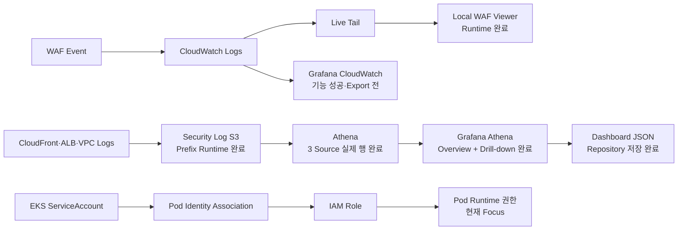

# Observability Current Status

> **용도:** 지금 어디까지 왔고, 바로 다음에 무엇을 해야 하는지만 확인하는 현황판  
> **기준 시점:** 2026-08-07  
> **현재 Focus:** EKS Pod Identity Inventory·Runtime 검증  
> **관련 결정:** [`OBSERVABILITY-IAM-DECISIONS.md`](./OBSERVABILITY-IAM-DECISIONS.md)  
> **전체 계획:** [`OBSERVABILITY-IAM-IMPLEMENTATION-PLAN.md`](./OBSERVABILITY-IAM-IMPLEMENTATION-PLAN.md)  
> **보고서 Evidence:** [`report/OBSERVABILITY-EVIDENCE-INDEX.md`](./report/OBSERVABILITY-EVIDENCE-INDEX.md)

현재 상태는 다음 우선순위로 판정한다.

```text
실제 Runtime 출력·화면
→ 현재 Repository Source
→ 결정 문서
→ 구현 계획
```

---

## 1. 한눈에 보는 현재 위치



### 현재 순서

```text
1. Pod Identity AWS·Kubernetes Inventory
2. Workload별 STS Identity·허용 API·거부 API 검증
3. Association 없는 ServiceAccount의 Node Role Negative Test
4. Grafana WAF Dashboard 마감·Export
5. WAF 단계적 보강
6. 최종 Evidence 통합
```

S3 Source별 저장, Athena 실제 분석, Grafana Athena 시각화는 닫았다. 새 Athena Panel을 추가하거나 같은 Dashboard를 계속 다듬지 않는다.

---

## 2. 현재 Runtime

최근 제공된 `daily-up` 결과:

| 항목 | 확인값 |
|---|---|
| AWS Account | `433048100798` |
| Primary Region | `ap-northeast-2` |
| Application Image | `433048100798.dkr.ecr.ap-northeast-2.amazonaws.com/aws-topology/application:sha-bc0e2f404646da2333663725656ac67934807410` |
| Argo CD | `Synced / Healthy` |
| Application | `dvwa: Ready` |
| URL | `https://unoh.click` |

> `daily-down.ps1` 실행 후에는 이 Runtime 표를 그대로 신뢰하지 않고 다시 확인한다.

---

## 3. Workstream 상태표

| Workstream | Runtime Evidence | 현재 판정 |
|---|---|---|
| Local WAF Live Viewer | XSS·SQLi·Filter·Clear·Pause·종료·지연 검증 | **완료** |
| Grafana CloudWatch WAF | XSS·SQLi 자동 표시 성공 | **기능 성공 / Export 전** |
| Security Log S3 Prefix | CloudFront·ALB·VPC 최신 Object 확인 | **완료** |
| Bucket Policy Write Scope | Runtime Policy 확인 | **완료 / CloudFront 정밀화 후보** |
| Glue Table `LOCATION` | 세 Table 실제 Prefix와 일치 | **완료** |
| CloudFront Athena | 34행 / 343,161 B / 주요 Column 정상 | **완료** |
| ALB Athena | 29행 / 573,530 B / 주요 Column 정상 | **완료** |
| VPC REJECT Athena | 999행 이상 / 3,608,387 B / 주요 Column 정상 | **완료** |
| Grafana Athena Overview | VPC·CloudFront·ALB Panel 실제 값 표시 | **완료** |
| Grafana 시간 범위 연동 | Overview 3 Panel Dashboard 시간 선택기 반영 | **완료** |
| Grafana Drill-down | `/dvwa/css/` 정상 패턴, `/wp-admin/install.php` 반복 Probe 분석 | **완료** |
| Grafana Athena JSON Export | Repository에 Runtime Export 저장 | **완료** |
| EKS Pod Identity | Source 정의 존재, Runtime 미검증 | **현재 Focus** |
| WAF Hardening | 계획만 존재 | **후속** |

---

## 4. 완료된 주요 Evidence

### 4.1 WAF Live Viewer

```text
Sample: 20, 17, 21, 20, 15, 20, 14초
최소: 14초
최대: 21초
평균: 약 18.1초
```

종료 후 `aws start-live-tail` 자식 Process와 TCP `8787` Listener가 남지 않는 것도 확인했다.

### 4.2 S3 Source별 Prefix

```text
CloudFront
→ AWSLogs/433048100798/CloudFront/

ALB
→ alb/primary/AWSLogs/433048100798/elasticloadbalancing/ap-northeast-2/

VPC REJECT
→ vpc-flow/AWSLogs/433048100798/vpcflowlogs/ap-northeast-2/
```

세 Source 모두 같은 Daily Runtime에서 최신 `.gz` Object를 생성했다.

### 4.3 Athena 실제 데이터

| Source | State | Data scanned | Rows |
|---|---:|---:|---:|
| CloudFront | SUCCEEDED | 343,161 B | 34 |
| ALB | SUCCEEDED | 573,530 B | 29 |
| VPC REJECT | SUCCEEDED | 3,608,387 B | 999+ |

VPC `999+`는 Query Pack의 결과 취득 상한 1000행에서 Header를 제외한 값이다.

### 4.4 Grafana Athena Dashboard

Dashboard:

```text
S3 Security Log Overview
```

Repository Export:

```text
analytics/dashboard/security-log-investigation.json
```

최종 Panel:

```text
VPC REJECT - Top Destination Ports
CloudFront - Top Requested Paths
ALB - Top Requested Routes
CloudFront - /dvwa/css/ Request Trace
CloudFront - /wp-admin/install.php Request Trace
```

검증 사항:

- CloudFront·ALB·VPC Overview가 각각 올바른 Athena Table을 조회한다.
- Overview 3 Panel은 Dashboard 시간 선택기를 실제 Query 범위에 반영한다.
- Drill-down SQL은 Client IPv4의 마지막 Octet을 `.xxx`로 마스킹한다.
- Credential, Raw Client IP, Request ID를 JSON에 하드코딩하지 않았다.
- Athena Data Source UID `efubxj2vag7i8b`는 보안정보가 아니지만 다른 Grafana에 Import할 때 재연결이 필요할 수 있다.

### 4.5 Drill-down 판정

#### `/dvwa/css/`

동일 Source의 `/`, `/login.php`, favicon, CSS 요청이 약 1초 내 연속 발생했다.

```text
정상 페이지 렌더링에 수반된 정적 리소스 요청 가능성 높음
```

#### `/wp-admin/install.php`

여러 Source에서 동일 WordPress 설치 경로가 반복 요청됐다.

```text
HTTP  GET /wp-admin/install.php → 301
HTTPS GET /wp-admin/install.php → 404
```

동일 Source 전후 ±60초에서 다른 관리·설정 Path 순회는 확인되지 않았다.

```text
반복 WordPress 설치 경로 Probe / 자동화 스캔 후보
다중 경로 정찰·공격 성공으로는 확대해석하지 않음
```

---

## 5. 원래 지시 4줄 충족도

| 지시 | 현재 상태 | 남은 것 |
|---|---|---|
| S3 로그 분석·Grafana 시각화 | 세 Source Athena + Grafana Overview + Drill-down + JSON Export | **완료** |
| EKS 각 Workload Pod Identity | Source 구성 존재 | Runtime STS·허용·거부·Node Role Negative Test |
| 리소스별 S3 로그 저장 구분 | 세 Prefix·최신 Object·Glue LOCATION 확인 | **핵심 완료** |
| 구성 결과 설명·시연 | WAF Viewer·S3·Athena·Grafana Drill-down 가능 | Pod Identity 후 최종 통합 |

전체 판정:

```text
근실시간 WAF 관제               완료
리소스별 S3 저장 구분            완료
Athena 실제 분석                 완료
Grafana S3/Athena 시각화         완료
Pod Identity Runtime             미검증
4줄 전체 완료                    아직 아님
```

---

## 6. 바로 다음 한 가지

### Pod Identity Inventory

먼저 변경 없이 다음 대응 관계를 Runtime에서 수집한다.

```text
Cluster
→ Namespace
→ Workload
→ ServiceAccount
→ Pod Identity Association
→ IAM Role ARN
```

예상 대상:

```text
AWS Load Balancer Controller
ExternalDNS
EFS CSI Controller
Web S3 Workload
Fluent Bit
Karpenter
```

Inventory가 Source와 일치하는지 확인한 뒤에만 STS·허용·거부 Test 방법을 확정한다. 즉석으로 Role·Policy·Association을 수정하지 않는다.

---

## 7. 이후 순서

```text
Pod Identity Inventory
→ Workload별 STS Identity
→ 대표 허용 API
→ 비허용 API AccessDenied
→ Node Role Negative Test
→ Grafana WAF Dashboard Export
→ WAF 단계적 보강
→ 최종 Evidence 통합
```

---

## 8. 지금 하지 않을 것

```text
Grafana Athena Panel 추가 확장
/wp-admin/install.php를 공격 성공으로 단정
새 Managed Rule Group 즉시 추가
WAF 전체 BLOCK 전환
Source별 S3 Bucket 재설계
Pod Identity 즉석 수정
```

---

## 9. Evidence 위치

### Repository

```text
OBSERVABILITY-IAM-DECISIONS.md
OBSERVABILITY-IAM-IMPLEMENTATION-PLAN.md
OBSERVABILITY-CURRENT-STATUS.md
report/OBSERVABILITY-EVIDENCE-INDEX.md
analytics/dashboard/security-log-investigation.json
tools/waf-live-viewer/
observability/queries/athena/
```

### Local Athena Evidence

```text
C:\Users\Unoh\Documents\aws-topology-evidence\athena-cloudfront-trace-20260807T021410Z
C:\Users\Unoh\Documents\aws-topology-evidence\athena-alb-window-20260807T022221Z
C:\Users\Unoh\Documents\aws-topology-evidence\athena-vpc-reject-20260807T022621Z
```

공개 Repository와 Screenshot에는 전체 Client IP, Request ID, JA3·JA4, Cookie, Authorization, 전체 Header, AWS Credential을 그대로 남기지 않는다.

---

## 10. 갱신 규칙

Checkpoint 하나가 끝났을 때만 갱신한다.

```text
현재 Focus
Workstream 상태표
완료된 Runtime 사실
바로 다음 한 가지
```
